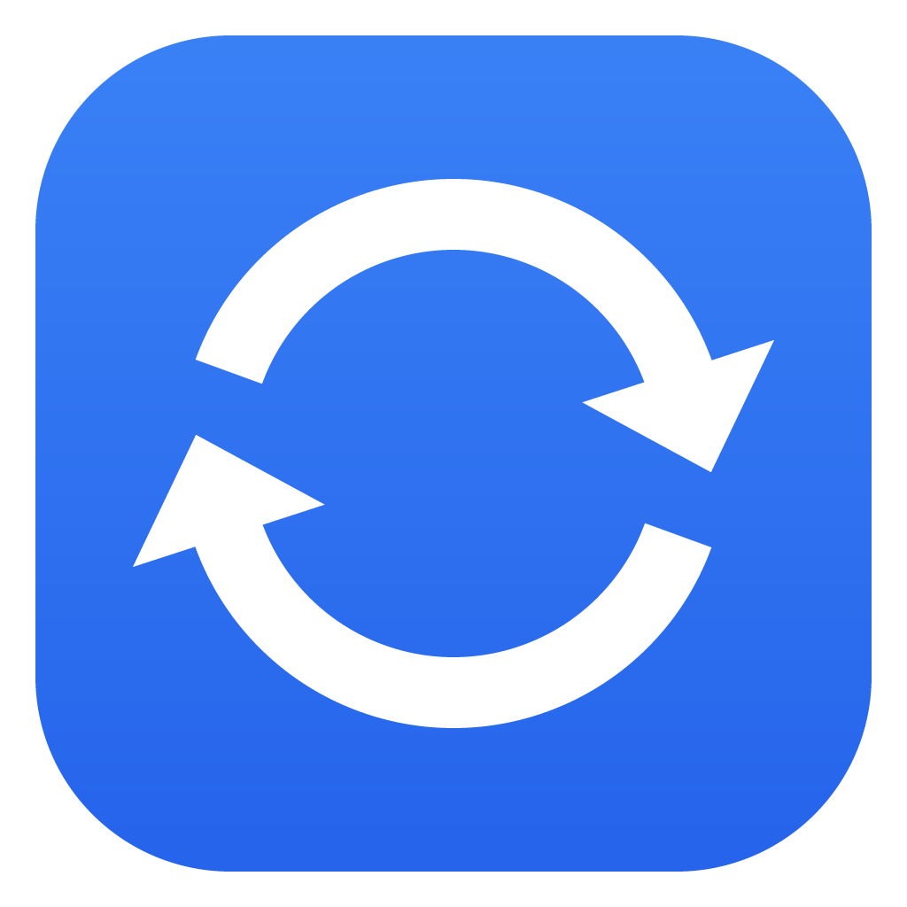

<p align="center"></p>

<h1 align="center">Syncer</h1>

<p align="center">Keep your PC game saves in sync between your Windows PCs, with a versioned backup in Google Drive.</p>

---

Syncer is a small desktop app built on two tools that already work well:

- **[Syncthing](https://syncthing.net)** copies saves directly between your PCs. There's no account and no cloud in between.
- **[Google Drive for desktop](https://www.google.com/drive/download/)** handles the upload. Syncer copies your saves into `My Drive\GameSaveBackup`, and Drive uploads them from there.

## Features

- **Finds your games, and keeps finding them.** It checks ~14k games from the [Ludusavi manifest](https://github.com/mtkennerly/ludusavi-manifest) (save locations from PCGamingWiki) against your PC in under a second. Newly installed games start syncing on their own (at logon, every few hours, and hourly while the window is open). Games you stop syncing are never added back. Save folders over 1 GB wait for a click; raise or remove that limit in Settings if your saves are bigger. You can also add any folder yourself.
- **Knows what Steam Cloud really covers.** A game supporting Steam Cloud isn't enough. Steam writes a `steam_autocloud.vdf` into every save folder it keeps in Steam Cloud, naming the Steam account. When that account uses this PC (signed in right now or not), Syncer leaves the folder to Steam Cloud and doesn't sync it by default, even while the game isn't installed here. It still syncs the folder when the Steam copy was cracked (`steam_emu.ini`, Goldberg's `steam_settings`, or a `steam_api` DLL without a valid Valve signature), when the game runs here from a Steam emulator or was installed through another store, when cloud sync is off for that account or game, or when the folder holds mod saves Steam skips (SKSE/F4SE co-saves, Seamless Co-op `.co2`). A marker naming an account that isn't on this PC came along with a copy from another PC and shows as *From another Steam account*. Folders without a marker get the older, stricter checks (Steam installed the game, its account keeps cloud saves for it, Steam tracks files in that very folder, and Steam has seen the latest save). `steam_autocloud.vdf` itself is never synced between PCs or restored from a backup, because it belongs to the PC it's on. Folders other PCs sync are not added where Steam Cloud keeps them. Games you already sync that Steam Cloud also keeps are marked *Also in Steam Cloud*, and *Leave them to Steam Cloud* turns their sync off (they stay backed up). You can choose to include Steam Cloud games too.
- **Leaves OneDrive's folders to OneDrive.** Saves inside a OneDrive folder (for example when Documents is moved into OneDrive) are already synced by OneDrive, and two sync tools on the same files make conflicting copies. New games found there are backed up only and marked *In OneDrive*. A game you do sync from there shows *Also in OneDrive*, and your other PCs' games aren't added into OneDrive automatically (*Games → Elsewhere* still offers them). A save folder with a second copy on the other side of OneDrive (for example `OneDrive\Documents\The Witcher 3` next to `Documents\The Witcher 3`, left behind by a PC that keeps or kept Documents in OneDrive) shows *Copy in OneDrive*, or *Newer copy in OneDrive* when that copy has the newer saves. Click it to open that copy.
- **Finds cracked games' saves.** Steam emulators keep what Steam would put in Steam Cloud in folders of their own (`Public\Documents\Steam\CODEX|RUNE\<appid>`, `Goldberg SteamEmu Saves`, `GSE Saves`, EMPRESS, SmartSteamEmu). Syncer finds them and lists them as, for example, *Baldur's Gate 3 (RUNE saves)*. Some games save twice: Baldur's Gate 3 writes each save into its own `PlayerProfiles` folder and a copy through the Steam Cloud API, which the emulator keeps in its folder. When the emulator folder holds the same saves as the game's own folder, it is marked *Copy of Baldur's Gate 3* and isn't added automatically, here or on your other PCs.
- **Links PCs with one ID.** Paste the other PC's device ID (or accept its request) and every synced game shows up there at the correct local path, even if the user name or Documents location is different.
- **Backs up with history.** Only changed files get copied. A file that changes or gets deleted is moved to `.versions\<game>\<time>\` and kept for 30 days by default. If a save folder suddenly turns up empty, Syncer won't wipe the backup.
- **Restores any save.** You can restore the latest backup or any earlier point. Your current files are saved as a restore point first, so a restore can be undone.
- **Lives in the tray if you want.** Settings can start Syncer with Windows (straight into the tray) and keep it running there when you close the window. The tray menu opens it, starts a backup, pauses or resumes, or quits.
- **Pause for a while.** *Settings* (or the tray) pauses syncing and automatic backups for 1 hour, 4 hours or until tomorrow morning. Every Syncthing folder is paused, and it all resumes on its own through a one-off scheduled task (`\Syncer-Resume`). *Back up now* still works while paused.
- **Tells you when something's wrong.** While Syncer runs (window or tray) you get a Windows notification when a backup fails, no backup has worked for 3 days, a save has two versions, another PC has a newer save that hasn't reached this PC yet, or a new Syncer release is out. The update check (once a day, GitHub only) and the notifications can be switched off in Settings.
- **Warns about a newer save on another PC.** If your other PC is off but backed up a newer save to the same Google account, the game shows *Newer on <PC>* (and you get a notification), so you don't start playing an older save. Each PC leaves a small file next to its backups (`GameSaveBackup\.syncer\<game>\<pc>.json`) saying which game a backup is and how new its saves are.
- **Runs without the window.** A scheduled task (`\Syncer-Background`) starts Syncthing if it isn't running, applies changes from your other PCs and runs the backup at logon and every few hours.
- **Never picks a save behind your back.** Before a PC starts syncing a game it already has saves for, those saves are stored as a restore point in the backup (or in `%LOCALAPPDATA%\Syncer\snapshots` when no backup folder is available). When two PCs changed the same save, the game shows **2 versions**: pick which one to keep, and the other goes into the backup history instead of being deleted. These restore points, and the one a restore makes of the files it replaces, are kept for a year instead of the usual history days.
- **Protects synced saves.** Every synced folder uses Syncthing's staggered versioning, so a corrupted save coming from another PC doesn't overwrite the good copy.
- **Never syncs the same files twice.** A folder that sits inside, or holds, a folder that's already synced is never added, whether you add it here or another PC syncs it. Older setups that did end up with one (a whole vendor folder like `Arrowhead` around the game's own save folder) show *Synced twice* with a one-click fix, and *Games → Elsewhere* offers only the game's own folder.
- **Back up without syncing.** Turn off *Sync* for a game (or pick *Back up only* when adding one) and it keeps being backed up from this PC without being shared with your other PCs. They stay in *Games → Your games* next to the synced ones, marked *Backup only*, with when each was last backed up, its size and its restore points. Turn off both *Sync* and *Backup* and the game stays in the list as *Off*: Syncer leaves it alone (and never adds it back) until you turn one on again.
- **Only installed games.** With *Settings → Only sync installed games* on, games from your other PCs and new games found here are added only when they're installed here (Steam, Epic, GOG, Ubisoft, Xbox and regular installers are recognized). *Stop syncing them* on the Games page stops syncing the ones that aren't installed; they start again once you install them. *Games → Elsewhere* lists everything else so you can add it by hand.
- **Back up saves of games you uninstalled.** *Found on this PC* marks saves whose game isn't installed, and *Back up only…* backs up all of them at once (you pick which) without syncing them.
- **Brings back old backups.** *Games → Elsewhere → In Google Drive* lists backups no game on this PC uses: games you removed here, or ones another PC backs up to the same account. *Add to Syncer* backs one up from this PC again (its history is kept) and can restore its saves right away.
- **Skips files you don't need.** The filter button on a game skips files like logs, crash dumps, screenshots or shader caches (Syncthing's `.stignore` patterns) for both syncing and the backup, on this PC.
- **Stays out of your way while you play.** Backups run at background CPU and disk priority, and the automatic backup waits while a full-screen app or an installed game is in the foreground (*Backup → Pause while playing*).
- **Undo.** Removing a game takes it out of Syncer and cleans up Syncthing's marker files (optionally deleting its backup too). *Settings → Undo everything* stops all syncing on this PC, and can also unlink your PCs, stop or uninstall Syncthing, and stop or delete backups. Neither ever deletes save files.
- **Deletes saves only when you really mean it.** From a game's *Remove* dialog, *Delete the save files…* asks you to type the game's name. It then stops syncing the game on this PC (your other PCs keep their copy), backs it up one last time (nothing is deleted if that fails) and moves the save folder to the Recycle Bin. The game stays in your games as *Backup only*, so you can restore it later.
- **Light and dark mode.** It follows your Windows setting (you can override it), and uses the Mica backdrop on Windows 11.

## Install

1. Download **`Syncer-amd64-installer.exe`** from [Releases](https://github.com/ApolloF/syncer/releases) and run it. It installs just for your user (no admin prompt) into `%LOCALAPPDATA%\Programs\Syncer` and adds Start menu and desktop shortcuts. Prefer no installer? `Syncer.exe` from the same release is portable. Keep it in a permanent folder, since the background task points at it.
2. Open Syncer. If Syncthing isn't installed yet, the Overview has a one-click install (via `winget`).
3. Install [Google Drive for desktop](https://www.google.com/drive/download/) and sign in. Syncer finds it on its own. Signed in with more than one Google account (e.g. `G:` and `H:`)? Pick which one gets the backups under **Backup → Account**.
4. Your games start syncing automatically. Check **Games → Found on this PC** for anything else you want, such as unrecognized folders.

### Linking a second PC

1. Install Syncer on the second PC.
2. On one PC, open **Devices** and paste the other PC's ID.
3. Accept the request that appears on the other PC.

That's all. Folders are published through a small shared folder (`syncer-meta`), where each PC writes only its own file, so no write conflicts can happen. Every PC adds whatever folders it's missing.

## How it works

```
 PC A                                  PC B
 ┌─────────────┐   Syncthing (P2P)   ┌─────────────┐
 │ save folders│◄───────────────────►│ save folders│
 │ syncer-meta │◄───────────────────►│ syncer-meta │  ← each PC's folder list, portable paths
 └──────┬──────┘                     └─────────────┘
        │ Syncer.exe --background (Task Scheduler)
        ▼
 G:\My Drive\GameSaveBackup\<game>\…      ← mirror
 G:\My Drive\GameSaveBackup\.versions\…   ← replaced/deleted files, pruned after N days
        │ Google Drive for desktop
        ▼
   Google Drive
```

Paths are stored relative to Windows known folders (Documents, Saved Games, AppData\Roaming/Local/LocalLow, profile), so they resolve correctly on every PC. That includes a Documents folder redirected to OneDrive.

Syncer stores its settings in `%APPDATA%\Syncer`. It reads Syncthing's API key from Syncthing's own `config.xml` whenever it needs it and never saves a copy.

### Security

- Folder lists from other PCs are treated as untrusted. Ids and paths are validated, and folders like your whole profile, `.ssh`, browser profiles, the Startup folder or Syncthing's own settings are never shared, even if another PC asks for them.
- Syncer talks to Syncthing only on this PC, or over HTTPS pinned to Syncthing's own certificate. It never sends the API key in the clear over the network.
- System tools (`schtasks`, `tasklist`, `explorer`) are started by their full path, and the scheduled task runs with your normal user rights (no elevation).

## Develop

Requirements: Go 1.26+, Node 22+, [Wails v2](https://wails.io) (`go install github.com/wailsapp/wails/v2/cmd/wails@latest`).

```bash
wails dev          # live-reloading app
go test ./...      # backend tests
wails build        # build/bin/Syncer.exe
```

The backend lives in `internal/`: `syncthing` (REST client), `meta` (cross-PC folder sharing), `discover` (manifest, scan, installed games), `backup` (mirror/versions/restore), `tasks` (Task Scheduler), `paths` (portable paths, sync safety rules) and `winx` (Windows priority, full-screen and foreground checks). The Svelte 5 frontend is in `frontend/src`.

## Uninstall

To stop syncing but keep the app, use *Settings → Undo everything* in Syncer first. Then uninstall with *Settings → Apps → Syncer → Uninstall*. This removes the app and its scheduled task. Syncthing, your synced saves and your Drive backups are left untouched.
