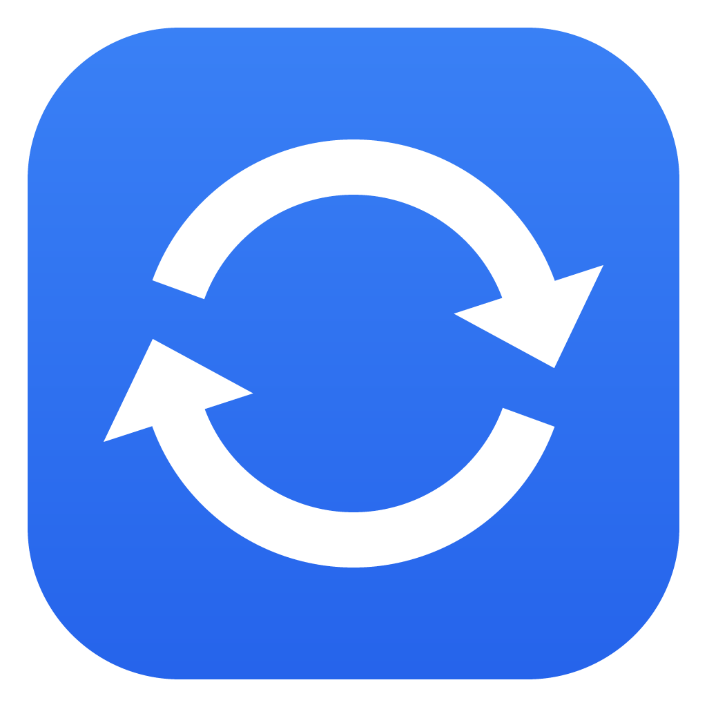

<p align="center"></p>

<h1 align="center">Syncer</h1>

<p align="center">Keep your PC game saves in sync between your Windows PCs, with a versioned backup in Google Drive.</p>

---

Syncer is a small desktop app built on two tools that already work well:

- **[Syncthing](https://syncthing.net)** copies saves between your PCs, end-to-end encrypted. There's no account and no cloud storage in between. Your PCs don't have to be on the same network: when they can't reach each other directly, Syncthing's public relays pass the encrypted data along.
- **[Google Drive for desktop](https://www.google.com/drive/download/)** handles the upload. Syncer copies your saves into `My Drive\GameSaveBackup`, and Drive uploads them from there. Don't want the Drive app? Syncer can sign in to Google itself instead.

## Features

- **Finds your games, and keeps finding them.** It checks ~14k games from the [Ludusavi manifest](https://github.com/mtkennerly/ludusavi-manifest) (save locations from PCGamingWiki) against your PC in under a second. Newly installed games start syncing on their own (at logon, every few hours, and hourly while the window is open). Games you stop syncing are never added back. Save folders over 1 GB wait for a click; raise or remove that limit in Settings if your saves are bigger. You can also add any folder yourself.
- **Knows what Steam Cloud really covers.** A game supporting Steam Cloud isn't enough. Steam writes a `steam_autocloud.vdf` into every save folder it keeps in Steam Cloud, naming the Steam account. When that account uses this PC (signed in right now or not), Syncer leaves the folder to Steam Cloud and doesn't sync it by default, even while the game isn't installed here. It still syncs the folder when the Steam copy was cracked (`steam_emu.ini`, Goldberg's `steam_settings`, or a `steam_api` DLL without a valid Valve signature), when the game runs here from a Steam emulator or was installed through another store, when cloud sync is off for that account or game, or when the folder holds mod saves Steam skips (SKSE/F4SE co-saves, Seamless Co-op `.co2`). A marker naming an account that isn't on this PC came along with a copy from another PC and shows as *From another Steam account*. Folders without a marker get the older, stricter checks (Steam installed the game, its account keeps cloud saves for it, Steam tracks files in that very folder, and Steam has seen the latest save). `steam_autocloud.vdf` itself is never synced between PCs or restored from a backup, because it belongs to the PC it's on. Folders other PCs sync are not added where Steam Cloud keeps them. Games you already sync that Steam Cloud also keeps are marked *Also in Steam Cloud*, and *Leave them to Steam Cloud* turns their sync off (they stay backed up). You can choose to include Steam Cloud games too.
- **Leaves OneDrive's folders to OneDrive.** Saves inside a OneDrive folder (for example when Documents is moved into OneDrive) are already synced by OneDrive, and two sync tools on the same files make conflicting copies. New games found there are backed up only and marked *In OneDrive*. A game you do sync from there shows *Also in OneDrive*, and your other PCs' games aren't added into OneDrive automatically (*Games → Elsewhere* still offers them). A save folder with a second copy on the other side of OneDrive (for example `OneDrive\Documents\The Witcher 3` next to `Documents\The Witcher 3`, left behind by a PC that keeps or kept Documents in OneDrive) shows *Copy in OneDrive*, or *Newer copy in OneDrive* when that copy has the newer saves. Click it to open that copy.
- **Finds cracked games' saves.** Steam emulators keep what Steam would put in Steam Cloud in folders of their own (`Public\Documents\Steam\CODEX|RUNE\<appid>`, `Goldberg SteamEmu Saves`, `GSE Saves`, EMPRESS, SmartSteamEmu). Syncer finds them and lists them as, for example, *Baldur's Gate 3 (RUNE saves)*. Some games save twice: Baldur's Gate 3 writes each save into its own `PlayerProfiles` folder and a copy through the Steam Cloud API, which the emulator keeps in its folder. When the emulator folder holds the same saves as the game's own folder (the same file names, or the same contents under other names, across all of the game's save folders), it is marked *Copy of Baldur's Gate 3* and isn't added automatically, here or on your other PCs. Copies already being synced get a notice with *Stop syncing the copies* (they stay backed up).
- **Knows Ubisoft Connect saves.** Ubisoft games (also ones bought on Steam, such as Assassin's Creed Odyssey) keep their saves in Ubisoft Connect's own `savegames\<account>\<game id>` folder, which Ubisoft Connect already keeps in its cloud. Syncer finds them there and backs them up without syncing them, marked *In Ubisoft Cloud*. Turn on *Sync* if Ubisoft Connect's cloud saves don't reach your other PCs. Cracked Ubisoft games save through a Ubisoft Connect emulator instead (`%APPDATA%\Goldberg UplayEmu Saves\<game id>`, or the `SavePath` in the game's `upc_r2.ini`). Syncer lists those as, for example, *Avatar: Frontiers of Pandora (UplayEmu saves)* and syncs them like any other game.
- **Links PCs with one ID.** Paste the other PC's device ID (or accept its request) and every synced game shows up there at the correct local path, even if the user name or Documents location is different.
- **Backs up with history.** Only changed files get copied. A file that changes or gets deleted is moved to `.versions\<game>\<time>\` and kept for 30 days by default. Older history is thinned: everything from the last day, then one restore point per day for a week, then one per week. Restoring to any point that's left still gives exactly the saves of that time. Restore points Syncer makes to protect your saves (before a PC starts syncing a game, before a restore, the losing copy of a conflict) are never thinned, and are kept for a year even when history is kept for less. A restore skips files that already match. If a save folder suddenly turns up empty, Syncer won't wipe the backup.
- **Backs up to Google Drive without the Drive app, if you like.** *Backup → Sign in with Google* lets Syncer sign in to your Google account itself. It asks only for access to the files it creates (it can't see anything else in your Drive), keeps a copy of the backup on this PC and syncs it with `My Drive\GameSaveBackup` before and after every backup. Your PCs share these backups when each signs in this way; backups made through Google Drive for desktop are separate.
- **Restores any save.** You can restore the latest backup or any earlier point. Your current files are saved as a restore point first, so a restore can be undone.
- **Lives in the tray if you want.** Settings can start Syncer with Windows (straight into the tray) and keep it running there when you close the window. The tray menu opens it, starts a backup, pauses or resumes, or quits.
- **Pause for a while.** *Settings* (or the tray) pauses syncing and automatic backups for 1 hour, 4 hours or until tomorrow morning. Every Syncthing folder is paused, and it all resumes on its own through a one-off scheduled task (`\Syncer-Resume`). *Back up now* still works while paused.
- **Tells you when something's wrong.** While Syncer runs (window or tray) you get a Windows notification when a backup fails, no backup has worked for 3 days, a save has two versions, another PC has a newer save that hasn't reached this PC yet, or a new Syncer release is out. The update check (once a day, GitHub only) and the notifications can be switched off in Settings.
- **Updates itself.** *Update now* (on the Overview, in Settings or in the tray menu) downloads the new `Syncer.exe` from the GitHub release, checks it against the release's SHA-256 checksum, puts it in place of the running one and restarts Syncer. This works for both installed and portable copies. While Syncer runs in the tray (no window open, no game running, no backup in progress), it installs updates by itself. You can switch that off under *Settings → Install updates automatically*.
- **Brings newer saves over even when the other PC is off.** Syncthing only syncs while both PCs are on. Each PC leaves a small file next to its backups (`GameSaveBackup\.syncer\<game>\<pc>.json`, plus a list of the files it backed up) saying which game a backup is and how new its saves are. When your other PC played later and is off now, Syncer takes its saves from its backup, like a cloud save, but only when nothing can get lost: the saves here must be exactly what this PC last backed up, no game may be running, and that PC's whole backup must have arrived through Google Drive. The saves here are kept as a restore point first. Otherwise the game shows *Newer on <PC>* (and you get a notification), with *Get it* when it can be taken by hand. It also happens at logon, before the background backup, and a launcher can ask for it before starting a game. Turn it off under *Settings → Take newer saves from other PCs' backups*.
- **Holds syncing while you play.** While a game runs (it was in front, and its exe is still running), changes from your other PCs wait until it exits, so no save changes under the running game. When it exits, Syncer backs up the new saves and looks for newer ones elsewhere. *Settings → Hold syncing while playing* turns this off. The Devices page shows whether a linked PC is on this network, reached over the internet, or through a Syncthing relay.
- **Runs without the window.** A scheduled task (`\Syncer-Background`) starts Syncthing if it isn't running, applies changes from your other PCs and runs the backup at logon and every few hours.
- **Works with game launchers.** A local API ([docs/api.md](docs/api.md)) lets a launcher such as [Seaglass](https://github.com/ApolloF/Seaglass) show a game's save status, sync its saves before it starts and back them up after it exits. When the window isn't open, the launcher starts `Syncer.exe --api`, which stops again once it's idle. Syncer can also sync the launcher's own data (Seaglass: playtime, achievements, settings). If that folder is emptied or replaced outside Syncer, Syncthing stops syncing it so the other PCs keep their copies; Syncer then brings back what the backup has (next to any file the launcher already started again, never over it) and has the folder join again like a new PC, so nothing is deleted on the other PCs.
- **Never picks a save behind your back.** Before a PC starts syncing a game it already has saves for, and before a game it already syncs is shared with a newly linked PC, those saves are stored as a restore point in the backup (or in `%LOCALAPPDATA%\Syncer\snapshots` when no backup folder is available; those move into the backup once there is one). When two PCs changed the same save, the game shows **2 versions**: pick which one to keep, file by file or all of one PC's versions at once (a save made of several files should come from one PC as a whole). The other version goes into the backup history instead of being deleted, and the current file is copied there before it's replaced, so a game holding the file open can't make it disappear. Syncthing keeps every conflict copy instead of only the newest ten.
- **Doesn't let an older PC overwrite the backup.** Your PCs back up into the same folder. A PC that was off while another one played backs up before the new saves have reached it; its older files never replace newer ones another PC backed up, and files it never had aren't moved away. The Backup page shows *Newer from another PC* when that happens.
- **Separate saves per person (optional).** Turn on *Settings → Accounts* when several people play on your PCs. Add everyone under *Accounts*; accounts are shared between linked PCs, and each PC has a player you can switch in the sidebar or the tray menu. Games stay shared until you separate them: *Separate saves…* on a game (or in the *2 versions* dialog, where you say whose the other version is) gives every account its own copy of that game's saves, synced to all your PCs. On each PC the account that's playing has its saves in the game's own folder, and the others wait in `SyncerAccounts` on the same drive; switching account swaps them. Each account's page lists the games it has its own saves of and their files, and for shared games which save files were probably written by whom (e.g. save slots). *Share again…* makes a game shared again with the saves you pick. Nothing is ever deleted along the way: a restore point is saved first, replaced files go to the backup history, and leftover folders go to `SyncerAccounts\.trash`. Every step is recorded, so if Syncer stops halfway it finishes the change the next time it starts. Accounts can only be turned off again once no game is separated.
- **Protects synced saves.** Every synced folder uses Syncthing's staggered versioning, so a corrupted save coming from another PC doesn't overwrite the good copy.
- **Never syncs the same files twice.** A folder that sits inside, or holds, a folder that's already synced is never added, whether you add it here or another PC syncs it. Older setups that did end up with one (a whole vendor folder like `Arrowhead` around the game's own save folder) show *Synced twice* with a one-click fix, and *Games → Elsewhere* offers only the game's own folder.
- **Back up without syncing.** Turn off *Sync* for a game (or pick *Back up only* when adding one) and it keeps being backed up from this PC without being shared with your other PCs. They stay in *Games → Your games* next to the synced ones, marked *Backup only*, with when each was last backed up, its size and its restore points. Turn off both *Sync* and *Backup* and the game stays in the list as *Off*: Syncer leaves it alone (and never adds it back) until you turn one on again.
- **Only installed games.** With *Settings → Only sync installed games* on, games from your other PCs and new games found here are added only when they're installed here (Steam, Epic, GOG, Ubisoft, Xbox and regular installers are recognized, and so are cracked or portable copies: a program Windows remembers running, or an install folder, with a Steam emulator beside it naming the game's Steam app id). *Stop syncing them* on the Games page stops syncing the ones that aren't installed; they start again once you install them. *Games → Elsewhere* lists everything else so you can add it by hand.
- **Back up saves of games you uninstalled.** *Found on this PC* marks saves whose game isn't installed, and *Back up only…* backs up all of them at once (you pick which) without syncing them.
- **Brings back old backups.** *Games → Elsewhere → In Google Drive* lists backups no game on this PC uses: games you removed here, or ones another PC backs up to the same account. *Add to Syncer* backs one up from this PC again (its history is kept) and can restore its saves right away.
- **Skips files you don't need.** The filter button on a game skips files like logs, crash dumps, screenshots or shader caches (Syncthing's `.stignore` patterns) for both syncing and the backup, on this PC.
- **Stays out of your way while you play.** Backups run at background CPU and disk priority, and the automatic backup waits while a full-screen app or an installed game is in the foreground (*Backup → Pause while playing*).
- **Undo.** Removing a game takes it out of Syncer and cleans up Syncthing's marker files (optionally deleting its backup too). *Settings → Undo everything* stops all syncing on this PC, and can also unlink your PCs, stop or uninstall Syncthing, and stop or delete backups. Neither ever deletes save files.
- **Deletes saves only when you really mean it.** From a game's *Remove* dialog, *Delete the save files…* asks you to type the game's name. It then stops syncing the game on this PC (your other PCs keep their copy), backs it up one last time (nothing is deleted if that fails) and moves the save folder to the Recycle Bin. The game stays in your games as *Backup only*, so you can restore it later.
- **Syncs your mods too (optional).** With *Settings → Find installed mods* on, a *Mods* page lists, game by game, the mods [Vortex](https://www.nexusmods.com/about/vortex/) installed for each game (its staging folder, wherever you keep it) and each game's load orders, with what's synced here, what's found on this PC and what your other PCs sync. Sync them like a save folder and they arrive in Vortex on your other PCs, ready to enable and deploy there. Other PCs find the folder through their own Vortex, never by a path another PC sends. Mod folders aren't backed up to Google Drive unless you turn their backup on, pause while Vortex is open so it never sees a half-arrived mod, and keep replaced files for a week in `%LOCALAPPDATA%\Syncer\mod-versions`. Each PC keeps its own game settings (`.ini` files). Experimental options add new mod folders automatically (up to a size you pick), sync the mods deployed into the game's own folder and share Vortex's mod list (see the next points). The mod settings are the same on all your PCs: change one on any PC and the others follow (the newest change wins), so two PCs never work against each other. The Mods page walks you through setting up a second PC.
- **Vortex on every PC (experimental).** Syncing the mods folder only brings the files: each PC's Vortex keeps its own list of mods, so a mod from another PC shows up there disabled and without its details. With *Settings → Manage synced mods with Vortex on every PC* on, Syncer also shares that list: which mods are installed and enabled, with their names, versions and Nexus ids. Install, update, enable or remove a mod in Vortex on any PC, and Vortex on your other PCs follows. Syncer reads and writes only the mod list in Vortex's database (`%APPDATA%\Vortex\state.v2`), only while Vortex is closed, and saves a copy of the database in `%LOCALAPPDATA%\Syncer\vortex-state` before each change. A mod from another PC is added once its files have fully arrived, and one removed elsewhere goes once its folder is gone. When the same mod changed on two PCs, the newer change wins; what each PC has when sharing starts is kept, and mods only one PC has are added to the others. *Use this PC's list…* on the Mods page makes your other PCs match this one. Each PC deploys with its own Vortex, so open it and deploy after changes arrive. Don't also receive a game's deployed mods on a PC where Vortex deploys that game.
- **Deployed mods, ready to play (experimental).** With *Settings → Sync deployed mods in the game folder* on, the PC where Vortex deploys a game becomes its *source* and sends exactly the files in Vortex's deployment (e.g. into Skyrim's `Data`), along with the load order (`plugins.txt`). The game's own files are never synced, changed or deleted. Your other PCs receive them without needing Vortex, from the source only (their folder is shared with no other PC), but only when you click *Apply*, and only after these checks pass: same game version (Steam build or the game's executable), Vortex and the game closed, the source online and not mid-change, enough disk space, and confirmation before it removes many files or any plugin, replaces one of the game's own files, or adds or changes program files (DLLs and the like). Before anything is pulled, the source's live file list must match what it announced. A game file a mod replaces is kept for good and comes back when the mod goes; the game's own files are never deleted. Before applying, Syncer copies every file the update replaces into `%LOCALAPPDATA%\Syncer\mod-snapshots`, so *Roll back* puts the folder back exactly. Every update is audited: afterwards Syncer checks every mod file and the game's own files. If anything is off, the folder stays paused and on hold, and you get a notification. The audit log is in `%APPDATA%\Syncer\mod-audit.json` and on the folder's *Audit* button. Deployed mods aren't backed up to Google Drive unless you turn on the folder's *Backup* toggle; then only the mod files are backed up, never the game's own. Vortex must deploy with hardlinks (its default), not symlinks.
- **Light and dark mode.** It follows your Windows setting (you can override it), and uses the Mica backdrop on Windows 11.

## Install

1. Download **`Syncer-amd64-installer.exe`** from [Releases](https://github.com/ApolloF/syncer/releases) and run it. It installs just for your user (no admin prompt) into `%LOCALAPPDATA%\Programs\Syncer` and adds Start menu and desktop shortcuts. Prefer no installer? `Syncer.exe` from the same release is portable. Keep it in a permanent folder, since the background task points at it. Using [Seaglass](https://github.com/ApolloF/Seaglass)? *Settings → Saves → Install Syncer* does this step for you.
2. Open Syncer. If Syncthing isn't installed yet, the Overview has a one-click install (via `winget`).
3. Install [Google Drive for desktop](https://www.google.com/drive/download/) and sign in (or use *Backup → Sign in with Google* instead). Syncer finds it on its own. Signed in with more than one Google account (e.g. `G:` and `H:`)? Pick which one gets the backups under **Backup → Account**.
4. Your games start syncing automatically. Check **Games → Found on this PC** for anything else you want, such as unrecognized folders.

You only install once. After that, Syncer updates itself.

### Linking a second PC

1. Install Syncer on the second PC.
2. On one PC, open **Devices** and paste the other PC's ID.
3. Accept the request that appears on the other PC.

That's all. Folders are published through a small shared folder (`syncer-meta`), where each PC writes only its own file, so no write conflicts can happen. Every PC adds whatever folders it's missing.

## How it works

```
 PC A                                  PC B
 ┌─────────────┐   Syncthing (P2P)   ┌─────────────┐
 │ save folders│◄───────────────────►│ save folders│
 │ syncer-meta │◄───────────────────►│ syncer-meta │  ← each PC's folder list, portable paths
 └──────┬──────┘                     └─────────────┘
        │ Syncer.exe --background (Task Scheduler)
        ▼
 G:\My Drive\GameSaveBackup\<game>\…      ← mirror
 G:\My Drive\GameSaveBackup\.versions\…   ← replaced/deleted files, thinned, pruned after N days
        │ Google Drive for desktop
        ▼
   Google Drive
```

A game with separate saves per account is one Syncthing folder per account (`<game>.u-<account>`), each synced between all PCs. Which one sits at the game's save folder is up to each PC's active account; the others are kept in `%LOCALAPPDATA%\SyncerAccounts` (or `<drive>\SyncerAccounts` when the saves are on another drive). Splits and merges are shared through `syncer-meta` like the folder lists, and every PC carries them out itself; a PC whose Syncer is too old to understand them holds splitting back until it's updated.

Paths are stored relative to Windows known folders (Documents, Saved Games, AppData\Roaming/Local/LocalLow, profile), so they resolve correctly on every PC. That includes a Documents folder redirected to OneDrive.

Syncer stores its settings in `%APPDATA%\Syncer`. It reads Syncthing's API key from Syncthing's own `config.xml` whenever it needs it and never saves a copy.

### Security

- Mod folders are shared by a name only each PC's own Vortex can turn into a folder (`vortex:<game>`), and must hold Vortex's staging marker. Vortex's own database and extensions, whole drives, system folders and store library folders are never shared. With *Manage synced mods with Vortex on every PC* on, only the mod list is taken from Vortex's database, and another PC's list is only used when Syncthing confirms that PC wrote it; each mod's id and folder must be a plain name inside the staging folder.
- Deployed mods come only from the PC that Syncthing confirms wrote the claim to send them. When another PC claims the role, nothing changes until you agree, on the old source and on every receiver.
- Folder lists from other PCs are treated as untrusted. Ids and paths are validated, and folders like your whole profile, `.ssh`, browser profiles, the Startup folder or Syncthing's own settings are never shared, even if another PC asks for them.
- Syncer talks to Syncthing only on this PC, or over HTTPS pinned to Syncthing's own certificate. It never sends the API key in the clear over the network.
- The launcher API is a named pipe that only your Windows account can open, never over the network. Launchers pass game names and folders; nothing they send is run or trusted as a path to change.
- System tools (`schtasks`, `tasklist`, `explorer`) are started by their full path, and the scheduled task runs with your normal user rights (no elevation).
- Signed in to Google through Syncer, it asks only for the `drive.file` scope (the files it creates). Its sign-in token is the one secret Syncer keeps: in `%APPDATA%\Syncer\gdrive.token`, encrypted with Windows' data protection for your account. *Sign out* revokes it at Google.

## License

Syncer is free software: you can redistribute it and/or modify it under the terms of the [GNU Affero General Public License v3.0](LICENSE). It comes with no warranty. The third-party code it includes is listed, with its licenses, in [THIRD_PARTY_NOTICES.md](THIRD_PARTY_NOTICES.md).

Game save locations come from the [Ludusavi manifest](https://github.com/mtkennerly/ludusavi-manifest), which is built from [PCGamingWiki](https://www.pcgamingwiki.com) (CC BY-NC-SA 3.0). Syncer downloads it at runtime and doesn't include it. Syncing is done by [Syncthing](https://syncthing.net) (MPL-2.0), installed separately.

## Develop

Requirements: Go 1.26+, Node 22+, [Wails v2](https://wails.io) (`go install github.com/wailsapp/wails/v2/cmd/wails@latest`).

```bash
wails dev          # live-reloading app
go test ./...      # backend tests
wails build        # build/bin/Syncer.exe
```

Release builds that should offer *Sign in with Google* need a Google OAuth client: in the [Google Cloud console](https://console.cloud.google.com), create a project, enable the Google Drive API, set up the OAuth consent screen (External, scope `.../auth/drive.file` only, then **publish** it; in Testing, sign-ins expire after 7 days) and create an OAuth client of type *Desktop app*. Put its id and secret in the repository secrets `GDRIVE_CLIENT_ID` and `GDRIVE_CLIENT_SECRET`; CI passes them in with `-ldflags "-X main.gdriveClientID=… -X main.gdriveClientSecret=…"`. (A desktop app's client secret isn't confidential.)

The backend lives in `internal/`: `syncthing` (REST client), `meta` (cross-PC folder sharing), `discover` (manifest, scan, installed games), `backup` (mirror/versions/restore), `gdrive` (Google sign-in and Drive sync), `tasks` (Task Scheduler), `paths` (portable paths, sync safety rules) and `winx` (Windows priority, full-screen and foreground checks). The Svelte 5 frontend is in `frontend/src`.

## Uninstall

To stop syncing but keep the app, use *Settings → Undo everything* in Syncer first. Then uninstall with *Settings → Apps → Syncer → Uninstall*. This removes the app and its scheduled task. Syncthing, your synced saves and your Drive backups are left untouched.
